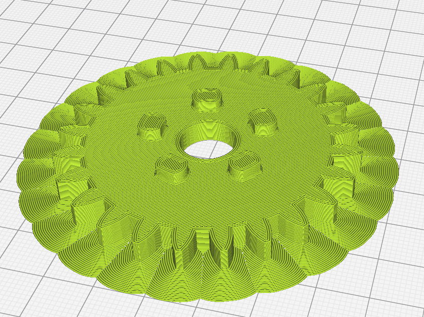

### Printing Requirements
All components within have to be 3D printed using ABS plastic filament at 60% infill. Below shows images of optimal build plate placements followed by material requirements.

##### Ring Gear
The ring gear must be printed as shown by the following figure:  

The total ABS requirement for this part is 43g (16.19m).

##### Input drive gears
The drive gears must be printed as shown by the following figure:  

The total ABS requirement for this part is 9g (3.31m) each. Total: 18g (6.62m).

Special consideration for this gear is that the keyway screw hole may not print correctly if a print cooler fan isn't equipped on the printer.

The overhang may not print correctly as a result. Therefore if necessary, the fabricator can add supports touching the model to ensure the screw hole prints correctly.

##### Planet gears
The planet gears of which THREE are required must be printed as per the following figure <rb>

The total ABS requirement each is 27g (10.27m) with a total of 81g (30.81m).

Special consideration for this gear is that the keyway screw hole may not print correctly if a print cooler fan isn't equipped on the printer.

The overhang may not print correctly as a result. Therefore if necessary, the fabricator can add supports touching the model to ensure the screw hole prints correctly.

##### Sun gear
The sun gear must be printed as per the following:

The total ABS requirement for this is 12g (4.71m).

##### Dog Gear with Collar
This part must be printed as per the following figure:

The total ABS requirement for this is 11g (3.99m).

This part must be printed upside down (while normally one would expect to print it the other way to reduce support usage) but it is necessary that the spline teeth must be correctly printed and this is best accomplished if they are printed directly from the build plate.

It is ideal that one use a printer with a smaller nozzle diameter to increase the spline teeth's resolution. But a printer with a regular 0.4mm nozzle should also suffice.

##### Dog Gear
This part must be printed as per the following figure:

The total ABS requirement for this is 5g (1.71m).

##### Shift Holder
This part must be printed as per the following figure:

The total ABS requirement for this is 7g (2.62m).

##### Spacing Washers
This part must be printed as per the following figure:

Together these parts require 1g of ABS (0.21m).

These two parts can be printed at once, however must be spaced out by at least 20mm to prevent stringing between the two (in case of poor retraction or bowden feed setups).

##### Total Material Requirement:
In order to print all the required parts to produce the gearbox, the fabricator will require 178g of ABS. Or 66.86m of 1.75mm ABS filament.

From Amazon, Dremel 1.75mm ABS filament (Black) 1KG costs $34.99 USD, the total used for this job would cost $6.23.

Link: https://www.amazon.com/Dremel-Nylon-Printer-Filament-Diameter/dp/B076MBTJBR/

The sliced renders and filament estimations were done using Ultimaker Cura (With the Tevo Tarantula (Reprap) as the printer).

Some of the models above are shown with a "sectional" view to show the interior infill.
